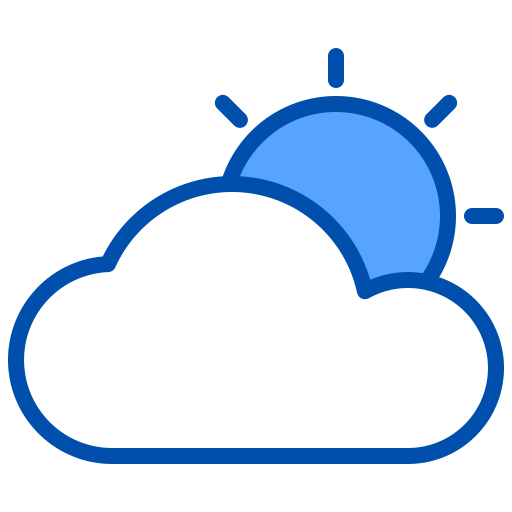

<a name="readme-top"></a>

<!-- PROJECT SHIELDS -->
<p align="center">
  <a href="https://personal-portfolio-0tdn.onrender.com/" alt="portfolio" target="_blank">
    
  </a>
  <a href="https://linkedin.com/in/alexcostai" alt="LinkedIn" target="_blank">
    
  </a>
  <a href="mailto:alexunio28@gmail.com" alt="Gmail" target="_blank">
    
  </a>
  <a href="https://github.com/alexcostai/" alt="github" target="_blank">
    
  </a>
</p>

<!-- PROJECT LOGO -->
<div align="center">
  <a href="https://github.com/alexcostai/weather-app">
    
  </a>
  <h3 align="center">Weather App</h3>
    <div align="center">
      
      
    </div>
  <p align="center">
    App of Weather
    <a href="https://github.com/alexcostai/weather-app"><strong>Explore the docs »</strong></a>
    <br />
    <br />
    <a href="https://github.com/alexcostai/weather-app/issues">Report Bug</a>
    ·
    <a href="https://github.com/alexcostai/weather-app/issues">Request Feature</a>
  </p>
</div>

<!-- TABLE OF CONTENTS -->
<details>
  <summary>Table of Contents</summary>
  <ol>
    <li>
      <a href="#about-the-project">About The Project</a>
      <ul>
        <li><a href="#built-with">Built With</a></li>
      </ul>
    </li>
    <li>
      <a href="#getting-started">Getting Started</a>
      <ul>
        <li><a href="#prerequisites">Prerequisites</a></li>
        <li><a href="#installation">Installation</a></li>
      </ul>
    </li>
    <li><a href="#usage">Usage</a></li
    <li><a href="#contact">Contact</a></li>
  </ol>
</details>

<!-- ABOUT THE PROJECT -->
## About The Project

<div align="center">
  
  
  
</div>


Weather App is a Open Source app that provides you with real-time weather updates.
Whit this app, you'll always know what to expect from the weather, so you can plan your day accordingly.

* Real-time weather updates: Get the latest weather conditions for your current location or any other city in the world.
* Detailed hourly and daily forecasts: Get a detailed forecast for the next 3 days, including temperature, precipitation, wind, and humidity.

<p align="right">(<a href="#readme-top">back to top</a>)</p>


### Built With

* [![React Native][reactnative.com]][reactnative-url]
* [![Expo][expo.com]][expo-url]
* [![Redux][redux.com]][redux-url]
* [![Axios][axios.com]][axios-url]

<p align="right">(<a href="#readme-top">back to top</a>)</p>


<!-- GETTING STARTED -->
## Getting Started

### Prerequisites

* npm
  ```sh
  npm install npm@latest -g
  ```

### Installation

1. Get a free API Key at [Free Weather API](https://www.weatherapi.com/)
2. Get a Google Maps API Key at [Google API](https://developers.google.com/maps/documentation/javascript/get-api-key?hl=es-419)
3. Clone the repo
   ```sh
   git clone https://github.com/alexcostai/weather-app.git
   ```
4. Install NPM packages
   ```sh
   npm install
   ```
5. Enter the config in `.env` file
   ```.env
   API_KEY = 'ENTER YOUR API';
   GOOGLE_MAPS_API_KEY = 'ENTER YOUR GOOGLE MAPS API';
   ```

<p align="right">(<a href="#readme-top">back to top</a>)</p>

<!-- CONTACT -->
## Contact

<p align="center">
  <a href="https://personal-portfolio-0tdn.onrender.com/" alt="portfolio" target="_blank">
    
  </a>
  <a href="https://linkedin.com/in/alexcostai" alt="LinkedIn" target="_blank">
    
  </a>
  <a href="mailto:alexunio28@gmail.com" alt="Gmail" target="_blank">
    
  </a>
  <a href="https://github.com/alexcostai/" alt="github" target="_blank">
    
  </a>
</p>


<p align="right">(<a href="#readme-top">back to top</a>)</p>

<!-- MARKDOWN LINKS & IMAGES -->
[reactnative.com]: https://img.shields.io/badge/React%20Native-20232A?style=for-the-badge&logo=react&logoColor=61DAFB
[reactnative-url]: https://reactnative.dev
[redux.com]: https://img.shields.io/badge/Redux-20232A?style=for-the-badge&logo=redux&logoColor=764abc
[redux-url]: https://redux.js.org
[axios.com]: https://img.shields.io/badge/axios-20232A?style=for-the-badge&logo=axios&logoColor=764abc
[axios-url]: https://axios-http.com/docs/intro
[expo.com]: https://img.shields.io/badge/expo-20232A?style=for-the-badge&logo=expo&logoColor=white
[expo-url]: https://expo.dev/
